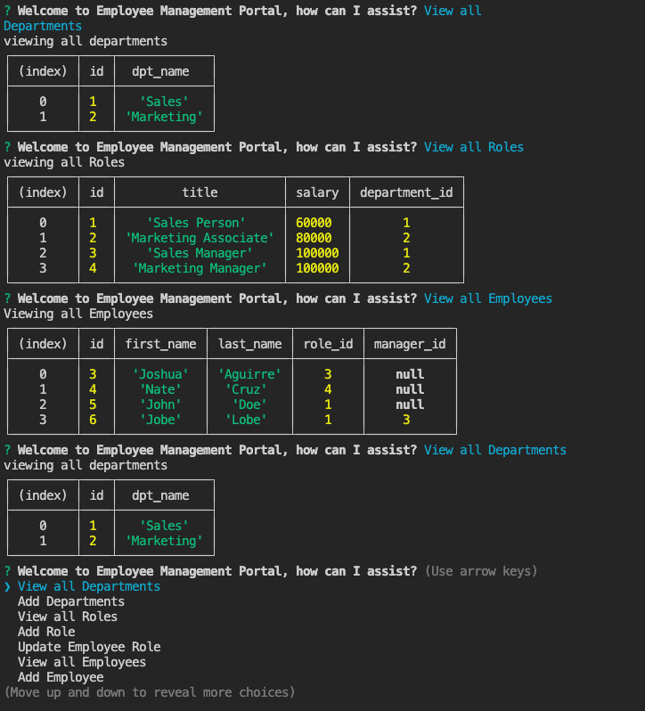

# Employee Management Portal

    

## Description
    
    This is a node.js app that allows the user's to manage a company's employee database with Inquirer and MySQL technologies.

[]

## Table of Contents

    
- [Installation](#installation) 
- [Usage](#usage) 
- [Licenses](#licenses) 
- [Contribute](#contribute) 
- [Testing](#testing) 
- [Questions](#questions)

    
## Installation
    
    Clone the repo, make sure you also have NPM, Inquirer, MySQL, and console.table packages on your device.

## Usage

    Run node index.js

## Licenses

    

MIT License

[]

## Contribute

    PR request. Merge subject to team review.

## Testing

    Run node index.js 

## Questions
 

Please reach out via Github: https://github.com/jshvaron or create an issue on the correlating repo page. For any further communication, please email me: nomail@mail.com.

